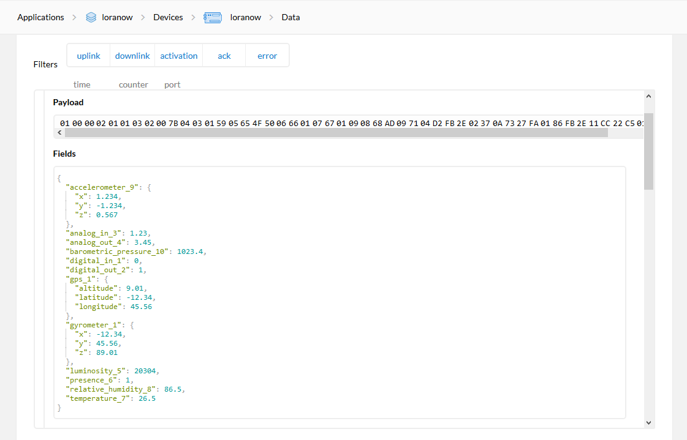

# CayenneLPPDecode

This is an Arduino Library Compatible to Decoder Cayenne Low Power Payload to Json format (ArduinoJson).

## Dependences

This library uses the [ArduinoJson](https://github.com/bblanchon/ArduinoJson) library.

## Installation

* Install the library by [Importing the .zip library](https://www.arduino.cc/en/Guide/Libraries#toc4) using either the [master](https://github.com/ricaun/CayenneLPPDecode/archive/master.zip) or one of the [releases](https://github.com/ricaun/CayenneLPPDecode/releases) ZIP files.

## Documentation

* API References:
    * [CayenneLPP](docs/CayenneLPP.md) ([Johan Stokking](https://github.com/TheThingsNetwork/arduino-device-lib))
    * [CayenneLPPDecode](docs/CayenneLPPDecode.md)

## Examples

The library comes with [examples](examples). After installing the library you need to restart the Arduino IDE before they can be found under **File > Examples > CayenneLPPDecode**.

## Quickstart

### CayenneLPP Input

```c++
lpp.addDigitalInput(1, 0);
lpp.addDigitalOutput(2, 1);
lpp.addAnalogInput(3, 1.23f);
lpp.addAnalogOutput(4, 3.45f);
lpp.addLuminosity(5, 20304);
lpp.addPresence(6, 1);
lpp.addTemperature(7, 26.5f);
lpp.addRelativeHumidity(8, 86.6f);
lpp.addAccelerometer(9, 1.234f, -1.234f, 0.567f);
lpp.addBarometricPressure(10, 1023.4f);
lpp.addGyrometer(1, -12.34f, 45.56f, 89.01f);
lpp.addGPS(1, -12.34f, 45.56f, 9.01f);
```

### CayenneLPPDecode Json Output

```json
{
  "digital_in_1": 0,
  "digital_out_2": 1,
  "analog_in_3": 1.23,
  "analog_out_4": 3.45,
  "luminosity_5": 20304,
  "presence_6": 1,
  "temperature_7": 26.5,
  "relative_humidity_8": 86.5,
  "accelerometer_9": {
    "x": 1.234,
    "y": -1.234,
    "z": 0.567
  },
  "barometric_pressure_10": 1023.4,
  "gyrometer_1": {
    "x": -12.34,
    "y": 45.56,
    "z": 89.01
  },
  "gps_1": {
    "latitude": -12.34,
    "longitude": 45.56,
    "altitude": 9.01
  }
}
```

## Json Field

The json field name was based on The Things Network payload format Cayenne LPP.



---

Do you like this library? Please [star this project on GitHub](https://github.com/ricaun/CayenneLPPDecode/stargazers)!

